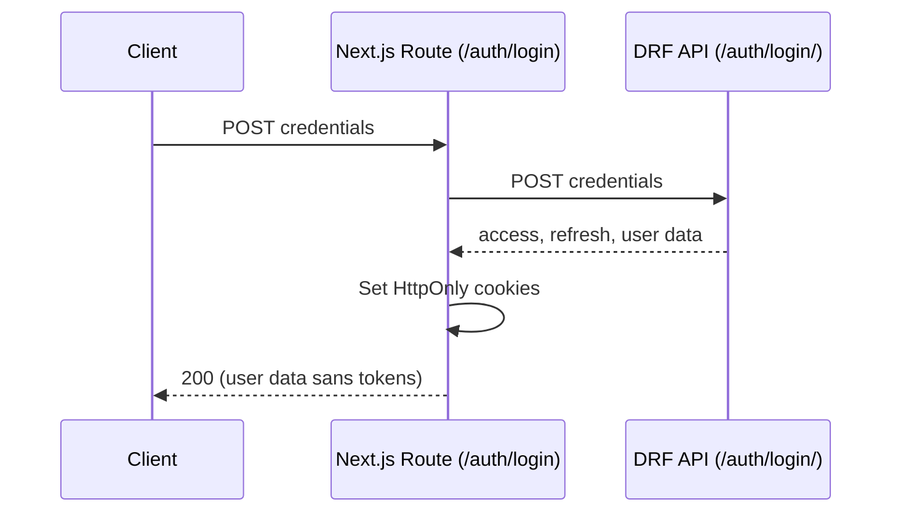
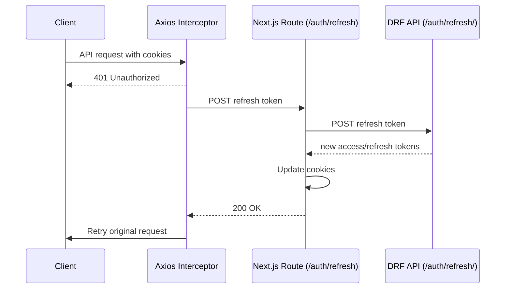
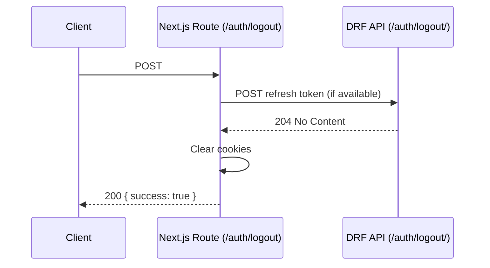

# Frontend Authentication Flow

The Next.js app proxies authentication requests to the Django REST Framework (DRF) backend through `/auth/*` route handlers. Tokens are **never** exposed to client-side JavaScript; they are stored as HttpOnly cookies.

## Cookies

| Cookie | Description | Max Age | Notes |
| --- | --- | --- | --- |
| `exam_access_token` | Short-lived JWT used for API requests | 5 minutes (configurable via API response) | HttpOnly, `SameSite=Lax`, `Secure` in production |
| `exam_refresh_token` | Refresh token for renewing the access token | 7 days (configurable via API response) | HttpOnly, `SameSite=Lax`, `Secure` in production |

When the DRF backend returns `access`, `refresh`, `access_expires_in`, or `refresh_expires_in` fields, the values override the default expirations.

## Route Handlers

- `POST /auth/login` → forwards credentials to `POST {API_BASE}/auth/login/`, stores returned cookies, and returns non-token payload (e.g., user profile).
- `POST /auth/refresh` → sends the stored refresh token to `POST {API_BASE}/auth/refresh/`, updates cookies, and retries the original API call on the client.
- `POST /auth/logout` → invalidates the session upstream and clears both cookies locally.

All handlers guard against upstream outages: failures return `503` with `{ detail: 'upstream_unreachable' }`.

## Sequence Diagrams

### Login

### Access Token Refresh

### Logout

## Axios + Error UX

- `src/lib/axios.ts` centralizes the API client with `withCredentials` to automatically send cookies.
- A response interceptor watches for `401` responses, calls `/auth/refresh`, and retries the original request once.
- Error messages are mapped to Persian toasts via `src/lib/api-error.ts`, covering DRF error codes such as `CAPACITY_OVERFLOW`, `BLACKOUT_CONFLICT`, `INVALID_CREDENTIALS`, and `TOKEN_NOT_VALID`.
- If refresh fails, the user receives the localized `TOKEN_NOT_VALID` toast and the failing promise is propagated for page-level handling.
